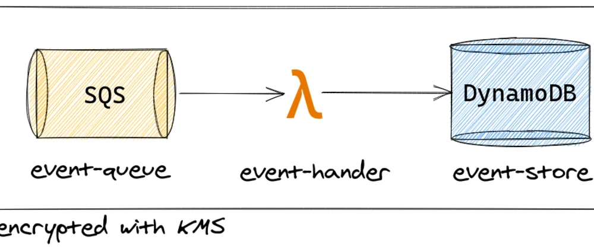

# dynamodb-as-eventstore

Using DynamoDB as EventStore with SQS and Lambda.

[](https://dev.to/aleixmorgadas/dynamodb-as-eventstore-3cbc)

Article at https://dev.to/aleixmorgadas/dynamodb-as-eventstore-3cbc

## Setup local environment

I assume you have:

- [Terraform installed](https://www.terraform.io/)
- [AWS Account](https://aws.amazon.com/)
- Python Environment

__Install Python Dependencies__

:information_source: I used Linux/Debian for this project, you might need to adapt the commands to your operating system.

```bash
python3 -m venv venv
source venv/bin/activate
pip install -r requirements.txt
```

You might need `python3-venv` as OS dependency installed.

## Deployment

:warning: __The provided solution will incur in your billing as some services are not part of the AWS Free Tier__ 

Before Deployment, you should check:

- `infrastructure/main.tf`. The region
- `infrastructure/variables.tf`. Set the read and write capacity of DynamoDB that you need. Default read-capacity 1, write-capacity 1. Also, prevent destroy for the `event-store` is set to false as default.

At `infrastructure` folder, execute `./run.sh`.

## Destroy Infrastructure :rescue_worker_helmet:

At `infrastructure` folder, execute `./destroy.sh`.

## Solution Design. Trade-offs

* Queue isn't a FIFO (First In-First Out).

It has consequences in the order the events are stored. Even though they contain a timestamp, they might get stored in a different order they have been produced.

In case of low traffic it might not be a real issue. But in case the application starts emitting events intensively that require them to be ordered, you might need to switch from a normal Queue to a FIFO Queue or Kinesis.

* Hash Key and Sort Key

Hash Key = `ID`
Sort Key = `Timestamp`

The idea is to have the Events Ordered by Timestamp.

* Items don't expire

I haven't configured the [Time to Live (TTL)](https://docs.aws.amazon.com/amazondynamodb/latest/developerguide/TTL.html) in DynamoDB. The table will grow in infinitum.w

* Only one Index\
You might want to add more indexes to query the events as you like.

  * Info in [Terraform](https://registry.terraform.io/providers/hashicorp/aws/latest/docs/resources/dynamodb_table#global_secondary_index) to add them in DynamoDB table configuration.

  * Info in [AWS About Global Secondary Indexes](https://docs.aws.amazon.com/amazondynamodb/latest/developerguide/GSI.html) and why you should define them to [perform queries instead of scans](https://docs.aws.amazon.com/amazondynamodb/latest/developerguide/bp-query-scan.html).

## Event Base

All events received by the lambda __must__ follow the next schema:

| Field     | Type      | Required  | Description   |
| ---       | ----      | ---       | ---           |
| Timestamp | Date      | true      | Time when event was created |
| EventType | String    | true      | Event identifier. Format `EVENT_EXAMPLE` |
| ID        | String    | true      | Id of the entity  |
| EmitterId | String    | true      | Id of the user or system that caused the event |
| EmitterType | String    | true      | `SYSTEM` or `USER` is what we use. It's a free text |
| Data      | Object     | false      | fields of the event |


In case of not following the schema, the event will be rejected.

Example:

```json
{
	"Timestamp"	: 1596719980,
	"EventType"	: "EVENT_TEST",
	"ID"		: "53877b2e-e496-11ea-b678-9b42a44d5e59",
	"EmitterId"	: "6b04fd08-e496-11ea-8176-9f85e075569c",
    "EmitterType": "USER",
	"Data"		: {
		"foo": "bar"
	}
}
```

## Technical Debt

- AWS Permissions

The different AWS Roles have too much permissions in their policies. It will be convenient that you restricted those to what's really required.

- AWS CloudWatch

It will be convenient to setup a CloudWatch Dashboard with the main metrics to check regularly to know how the system is behaving.
